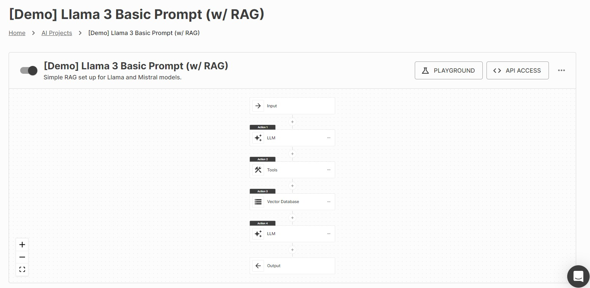

Here's a sample `README.md` file for your project:

---

# [Demo] Llama 3 Basic Prompt (w/ RAG)

This project demonstrates a simple Retrieval-Augmented Generation (RAG) setup using Llama and Mistral models. The system allows for dynamic and intelligent responses based on user inputs, leveraging vector databases for enhanced context retrieval.

---

## Table of Contents

- [Overview](#overview)
- [Features](#features)
- [Setup](#setup)
- [Usage](#usage)
- [Example API Call](#example-api-call)
- [Future Enhancements](#future-enhancements)

---

## Overview

This project integrates:
- **Input Handling**: Accepts user queries.
- **LLM Processing**: Utilizes Llama/Mistral for natural language understanding and generation.
- **Tool Integration**: Adds additional functionality via external tools.
- **Vector Database**: Enhances context retrieval for accurate and contextualized responses.
- **Output Generation**: Returns a refined and relevant response.

The workflow is visually represented in the image below:



---

## Features

- **Retrieval-Augmented Generation**: Combines LLMs with vector databases for intelligent query handling.
- **Modular Design**: Easily extendable for additional features or integrations.
- **Simple API Access**: Allows for seamless interaction via API endpoints.

---

## Setup

1. Clone the repository:
   ```bash
   git clone https://github.com/your-repo/demo-llama3-rag.git
   cd demo-llama3-rag
   ```

2. Install dependencies:
   ```bash
   pip install requests
   ```

3. Set up environment variables:
   - `API_KEY`: Your API key for authentication.
   - `CHANNEL_TOKEN`: Replace with the actual channel token for API calls.

4. Save the image `RAG.jpg` in the root directory for visual reference.

---

## Usage

### Run the Script
To execute the provided script:
```bash
python main.py
```

### Example API Call
The following Python script demonstrates how to interact with the API:

```python
import requests
import json

API_KEY = "your-api-key"
channel_token = "your-channel-token"
url = f"https://payload.vextapp.com/hook/30C6E7ZL81/catch/{channel_token}"
headers = {
    "Content-Type": "application/json",
    "apikey": f"api-key {API_KEY}"
}
data = {
    "payload": "what is artificial intelligence"
}

response = requests.post(url, headers=headers, json=data)
response_data = response.json()

# Extract and print only the text from the response
print(response_data["text"])
```

Replace `your-api-key` and `your-channel-token` with actual values.

---

## Future Enhancements

- Add support for multiple LLMs.
- Improve vector database integration.
- Include detailed logging and error handling.
- Build a web-based interface for user interaction.

---

Feel free to contribute or raise issues in the repository!

---
